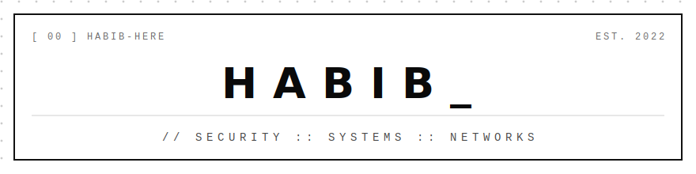

<div align="center">

<picture>
  <source media="(prefers-color-scheme: dark)" srcset="assets/header-dark.svg">
  <source media="(prefers-color-scheme: light)" srcset="assets/header-light.svg">
  
</picture>

</div>

## `// ABOUT`

```text
$ whoami
security-minded systems builder. i like software that runs close to the
metal — raw TCP pipelines, file-integrity monitors, encrypted channels,
and networks wired together by hand.

$ cat focus.txt
[01] CYBERSECURITY   threat detection · integrity monitoring · applied crypto
[02] NETWORKING      routing protocols · VPN control planes · socket programming
[03] SYSTEMS         linux · containers · low-level C++ & assembly
```

## `// STACK`

```text
LANGUAGES    Python ░ C++ ░ Shell ░ JavaScript ░ Java ░ x86 Assembly (MASM)
SECURITY     SHA-256 integrity pipelines ░ AES / Diffie-Hellman ░ WireGuard ░ zero-trust
NETWORKS     EIGRP ░ OSPF ░ RIP ░ VLSM ░ NAT ░ ACLs ░ raw sockets
SYSTEMS      Linux ░ Docker ░ Git ░ TCP streaming ░ CI/CD
```

## `// SELECTED WORK`

| INDEX | REPOSITORY | NOTES |
|:-----:|:-----------|:------|
| `00` | [**Secure-File-Integrity-Monitor**](https://github.com/habib-here/Secure-File-Integrity-Monitor) | File integrity monitoring agent — real-time threat detection, SHA-256 verification, immutable logging. Docker-ready for SOC deployment. |
| `01` | [**Edge-Health-Monitor**](https://github.com/habib-here/Edge-Health-Monitor) | Containerized producer–consumer pipeline streaming live system metrics over raw TCP with threshold alerting. Native Linux utilities only — no agents, no cloud. |
| `02` | [**Secure-Communication-System**](https://github.com/habib-here/Secure-Communication-System) | Client–server chat with Diffie–Hellman key exchange and AES-CBC encrypted authentication. |
| `03` | [**Advanced-Network-Simulation**](https://github.com/habib-here/Advanced-Network-Simulation-Integrating-EIGRP-OSPF-RIP-with-VLSM-NAT-ACLs) | Multi-protocol network design integrating EIGRP, OSPF & RIP with VLSM, NAT and ACLs. |
| `04` | [**Inventory-Management-System**](https://github.com/habib-here/Inventory-Management-System-using-BST) | C++ inventory engine built on binary search trees. |

## `// ACTIVITY`

<div align="center">

<picture>
  <source media="(prefers-color-scheme: dark)" srcset="https://raw.githubusercontent.com/habib-here/habib-here/output/github-snake-dark.svg">
  <source media="(prefers-color-scheme: light)" srcset="https://raw.githubusercontent.com/habib-here/habib-here/output/github-snake.svg">
  
</picture>

<br><br>

<picture>
  <source media="(prefers-color-scheme: dark)" srcset="https://github-readme-stats.vercel.app/api?username=habib-here&show_icons=true&hide_border=true&hide_title=true&bg_color=00000000&text_color=9e9e9e&icon_color=ffffff&ring_color=ffffff&hide_rank=false&include_all_commits=true">
  <source media="(prefers-color-scheme: light)" srcset="https://github-readme-stats.vercel.app/api?username=habib-here&show_icons=true&hide_border=true&hide_title=true&bg_color=00000000&text_color=4a4a4a&icon_color=000000&ring_color=000000&hide_rank=false&include_all_commits=true">
  
</picture>

</div>

## `// CONTACT`

```text
$ cat contact.txt
GITHUB    github.com/habib-here
WEB       habib-here.github.io
EMAIL     hcryptoismine@gmail.com
```

<div align="center">
<br>

`MONOTONE BY DESIGN — NO COLORS WERE HARMED`

</div>
